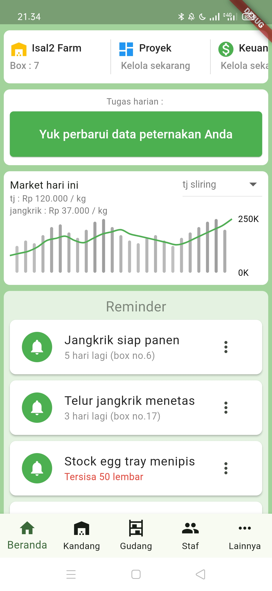

# JangkrikMaster

JangkrykMaster adalah aplikasi manajemen peternakan jangkrik yang dirancang dengan fitur-fitur seperti manajemen kandang, gudang, staf, keuangan, memudahkan peternak dalam mengelola budidaya jangkrik.

## Fitur Utama

- **Manajemen Kandang**: Mengelola kandang jangkrik, penjadwalan penetasan dan panen.
- **Manajemen Gudang**: Menyimpan dan mengelola stok kebutuhan peternakan.
- **Manajemen Anggota**: Mengatur anggota/staf yang terlibat dalam operasional peternakan.
- **Menu Lainnya**: Pengaturan akun dan pengaturan lainnya.

## Tampilan Aplikasi

### 1. Beranda

### 2. Menu Kandang

### 3. Menu Gudang

### 4. Daftar Anggota

### 5. Menu Lainnya
